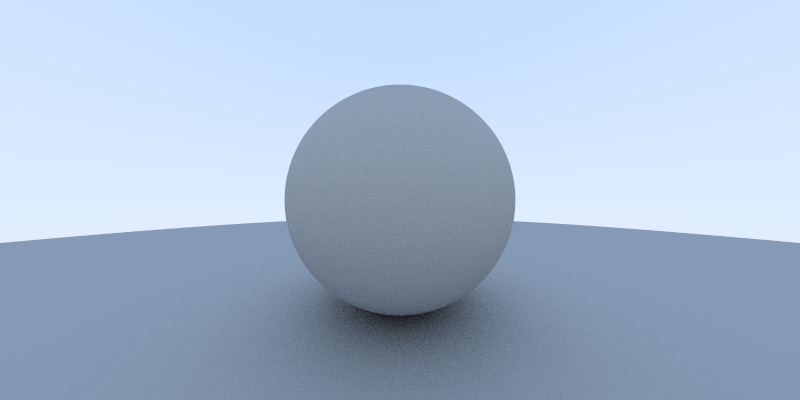

# raytracer

[](https://circleci.com/gh/r0bert1/raytracer)
[](https://codecov.io/gh/r0bert1/raytracer)



## Dokumentointi

[Määrittelydokumentti](https://github.com/r0bert1/raytracer/blob/master/docs/maarittelydokumentti.md)

[Toteutusdokumentti](https://github.com/r0bert1/raytracer/blob/master/docs/Toteutusdokumentti.md)

[Testausdokumentti](https://github.com/r0bert1/raytracer/blob/master/docs/Testausdokumentti.md)

#### Viikkoraportit:

[Viikko 1](https://github.com/r0bert1/raytracer/blob/master/docs/viikkoraportti1.md)

[Viikko 2](https://github.com/r0bert1/raytracer/blob/master/docs/viikkoraportti2.md)

[Viikko 3](https://github.com/r0bert1/raytracer/blob/master/docs/viikkoraportti3.md)

[Viikko 4](https://github.com/r0bert1/raytracer/blob/master/docs/viikkoraportti4.md)

[Viikko 5](https://github.com/r0bert1/raytracer/blob/master/docs/viikkoraportti5.md)

## Käyttöohje

Suorita juurikansiossa ensin

```
./gradlew build
```

Aja sitten ohjelma suorittamalla

```
./gradlew run
```

Testit ajetaan komennolla

```
./gradlew test
```

(Käytä windowsilla gradlew.bat ./gradlew sijaan)
